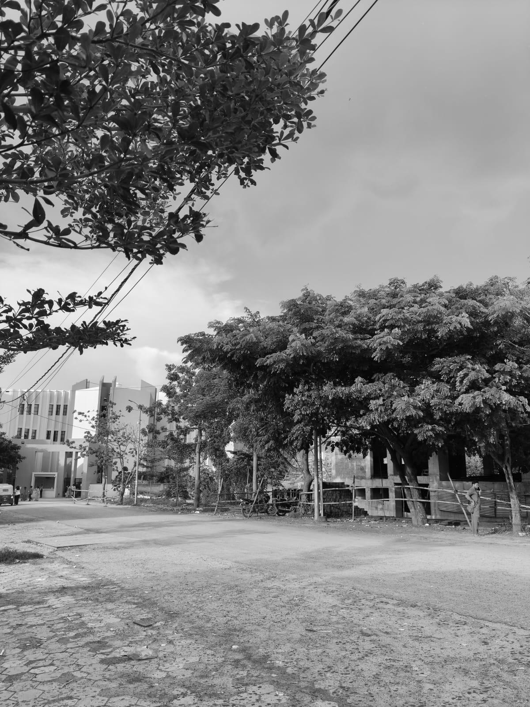

# 📸 Image to Grayscale Converter (Python)

A simple Python project that takes a **local colorful image** and converts it into a **grayscale image** while also printing its **2D intensity matrix**.  
This project is ideal for beginners learning image processing or computer vision.

---

## 🖥️ Creating & Using a Virtual Environment (venv)

It is recommended to run this project inside a **virtual environment** so that the required packages do not affect your system-wide Python installation.

### 1. Create a virtual environment

```bash
python -m venv venv
````

### 2. Activate the virtual environment

**Windows:**

```bash
venv\Scripts\activate
```

**macOS / Linux:**

```bash
source venv/bin/activate
```

Once activated, your terminal will show something like:

```
(venv) $
```

---

## 📦 Install Dependencies

After activating your venv, install all required packages:

```bash
pip install -r requirements.txt
```

Your `requirements.txt` should contain:

```
Pillow
numpy
matplotlib
```

---

## ▶️ Running the Project

Place your image in the project folder (e.g., `your_photo.jpg`), then run:

```bash
python main.py
```

This will:

* Load your image
* Convert it to grayscale
* Display the grayscale result
* Print the grayscale 2D matrix (pixel intensities)

---

## 🗂️ Recommended Project Structure

```
project-folder/
│── main.py
│── requirements.txt
│── your_photo.jpg
│── README.md
└── venv/
```

---

## 🖼️ Example Output

### Original Image

*(Replace with your actual colorful image)*


---

### Grayscale Result

*(If you choose to save it in your script)*


---

## 🎉 Got the output!

```
[[110  56  26 ... 183 183 182]
 [ 93  50  29 ... 183 183 182]
 [ 70  43  34 ... 183 183 182]
 ...
 [161 159 156 ... 132 148 163]
 [160 157 154 ... 126 138 149]
 [158 155 152 ... 152 150 135]]
```

You now have a clean and simple Python image-processing project.
Feel free to extend it with:

* Image filters
* Edge detection
* Histogram visualization
* Color channel analysis

Happy coding! 🚀

